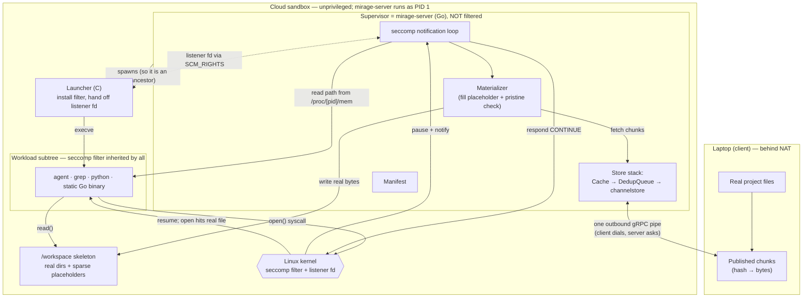
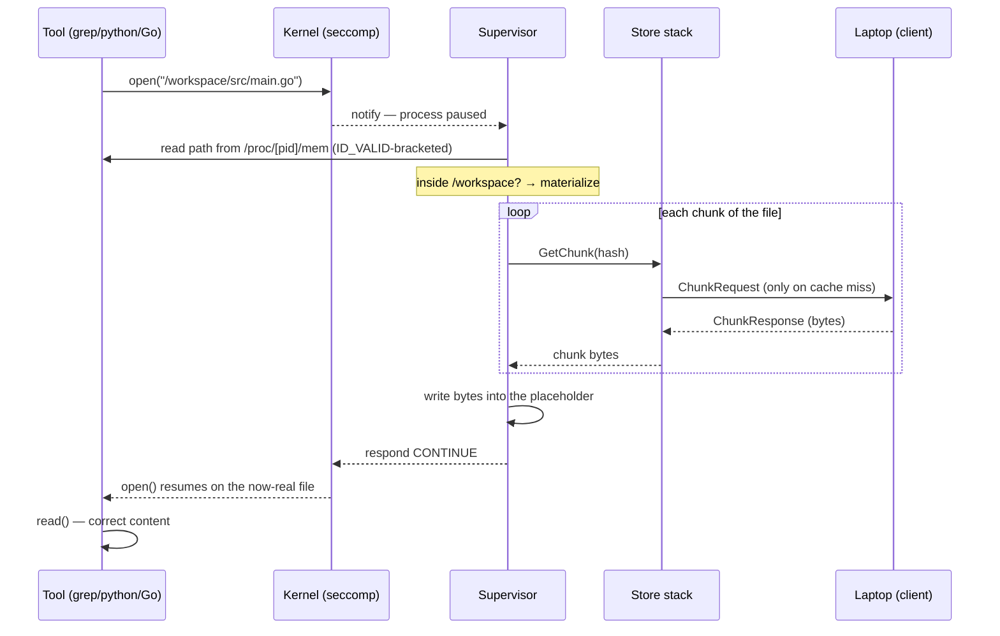

# How Mirage Works with seccomp (the FUSE-free path, a plain-language tour)

**Audience:** a software engineer who has read (or skimmed)
[`how-mirage-works.md`](./how-mirage-works.md) and understands the basics —
chunks, the manifest, the outbound-only connection, the "Store" that fetches a
chunk by its fingerprint. This document explains how Mirage projects a lazy
workspace **without FUSE**, using a Linux kernel feature called **seccomp user
notification**. No prior seccomp knowledge needed.

If you only remember one sentence: **Shimmer makes a real directory of empty
placeholder files look like your whole project, and uses the kernel to pause any
program the instant it opens one of those files — long enough for Mirage to fill
it in with real content before the program reads it.**

This path is called **Shimmer**. It exists for one reason: the FUSE approach
from the other doc can't run on locked-down container platforms like AWS
Fargate. Everything else — chunks, the manifest, the client-dials/server-asks
connection, the cache/dedup store stack — is **reused unchanged**. Shimmer only
replaces the *last mile*: how a file read inside the sandbox turns into "fetch
this file's chunks."

---

## 1. The problem: FUSE needs privileges Fargate won't give

The other doc's final piece was **FUSE** — a way for a normal program to *be* a
filesystem, so the kernel calls back into Mirage on every read and Mirage faults
just the chunks touched. It's elegant, and where it runs, it's the best option.

But FUSE needs two things from the host: a special device (`/dev/fuse`) and a
powerful capability (`CAP_SYS_ADMIN`). Many modern container platforms — AWS
Fargate is the headline example — **forbid both**, and won't let you change
that. On those platforms FUSE is simply off the table.

So we need the *same experience* — a `/workspace` whose files materialize on
demand — with **zero kernel privileges**: no special devices, no capabilities,
nothing a hardened sandbox would deny.

---

## 2. Building block #1: the skeleton (real dirs, empty placeholder files)

Start with a trick that needs no privileges at all.

When the manifest arrives (the list of files and their chunk fingerprints — same
manifest as always), Mirage **builds the directory tree for real on local disk**:
every folder is a real folder, and every file is created as a **sparse
placeholder** — a real file with the correct *name, size, and permissions*, but
whose contents are all zeros and which takes up **no actual disk space** (that's
what "sparse" means: the filesystem records "this file is 2 MB of nothing"
without storing 2 MB).

We call this the **skeleton**. Building it is cheap — it's just metadata, no
chunk is fetched — and it has a wonderful payoff:

> Commands that only look at file *metadata* — `ls`, `find`, `stat`, shell
> globs like `*.go`, `du` — **just work, natively, for every program**, because
> the metadata on disk is already correct and real. No interception needed.

The only thing the skeleton *can't* answer is the file's **contents**. A
placeholder is full of zeros until someone fills it. That filling is the rest of
the story.

(Code: `server/shim` builds the skeleton and tracks each file's state —
`placeholder`, `materialized`, or locally-modified.)

---

## 3. Building block #2: seccomp user notification ("FUSE for syscalls")

Here's the kernel feature that replaces FUSE.

### What a syscall is

When a program opens a file, it doesn't talk to the disk directly — it asks the
kernel, via a **syscall** (`open`, or on modern Linux `openat`). The syscall is
the doorway between a program and the operating system. *Every* program goes
through it: Python, grep, a shell, a Go binary — all of them, no exceptions.

### seccomp, normally

**seccomp** is a Linux security feature that lets you install a filter saying
"this process may make these syscalls, but not those." It's how container
runtimes block dangerous syscalls.

### The twist: "user notification"

A newer seccomp mode (Linux 5.0+) does something cleverer than allow/deny. You
can install a filter that says: *"when this process calls `open`, **pause it**
and **notify a supervisor program**."* The supervisor — an ordinary, unprivileged
program — receives a message: "process 1234 is trying to open a file; it's
parked, waiting." The supervisor does whatever it needs, then tells the kernel
"OK, let it proceed" (or "here's the answer"). Only then does the paused program
continue.

This is exactly the FUSE idea — *the kernel calls back into our program when
something happens* — but at the **syscall layer** instead of the filesystem
layer. People call it **"FUSE for syscalls."** And crucially, installing this
kind of filter needs **no special privilege** — just a one-time promise (a flag
called `no_new_privs`) that the process won't try to gain privileges. That's why
it works on Fargate where FUSE can't.

### Why this beats the old LD_PRELOAD idea

Mirage briefly used a different trick — `LD_PRELOAD`, which swaps out the C
library's `open` function inside each program. The fatal flaw: **Go programs and
statically-linked binaries don't use the C library** — they make raw syscalls
directly — so `LD_PRELOAD` is blind to them, and they'd silently read
placeholder zeros. seccomp sits at the syscall doorway *every* program must pass
through, so **nothing can bypass it**: Go, static binaries, anything. That
completeness is the whole reason Mirage moved to seccomp.

---

## 4. Building block #3: who's who — launcher, supervisor, listener

Three pieces make the seccomp path work. (The "supervisor" is just
`mirage-server` running in its Shimmer mode — not a new program.)

- **The supervisor** (Go) — already holds the manifest, the skeleton, and the
  chunk store. It will service the pauses.
- **The launcher** (a tiny C program) — its only job is to install the seccomp
  filter and then start the real workload.
- **The listener** — *not a program.* It's a special file descriptor the kernel
  hands back when you install a notification filter. Whoever holds it receives
  the "a process is paused at `open`" messages.

Here's how they connect. The launcher installs the filter on **itself**, which
yields the listener fd. It passes that fd over to the supervisor, then
`exec`s into the workload (the agent, a shell, whatever). Because a seccomp
filter is **inherited by every child and grandchild**, the entire workload — and
every tool it ever spawns — is now trapped, automatically, with no per-program
setup. The supervisor holds the listener and services everyone.

```
   supervisor (mirage-server)         ← holds manifest + skeleton + chunk store
     │   holds the listener fd, services pauses
     │
     └── launcher (C)                 ← installs the filter, passes the listener up
           └── workload (agent)       ← filter inherited here…
                 ├── grep             ← …and here…
                 └── python           ← …and here. all trapped, no setup.
```

### The components, wired together



### One important rule: the supervisor must be an *ancestor*

To know *which file* a paused program is opening, the supervisor has to read the
filename out of that program's memory. Linux only lets you read another
process's memory if you're an **ancestor** of it (this is the `ptrace_scope=1`
setting we measured on Fargate). That's why the launcher is started *by* the
supervisor, underneath it in the process tree — and in a real deployment the
supervisor runs as **PID 1** (the container's first process), so every process
in the sandbox is its descendant by construction. Get this wiring wrong (start
the agent as a sibling, or from a separate `exec` session) and the supervisor
can't read memory and interception fails — so it's a hard requirement, not a
detail.

---

## 5. Putting it together: what happens when a program opens a file

Say the agent runs `cat /workspace/src/main.go`. Step by step:

1. **Trap.** `cat` calls `openat("/workspace/src/main.go")`. The kernel pauses
   `cat` and sends a notification to the supervisor over the listener.
2. **Read the path.** The supervisor reads the filename out of `cat`'s paused
   memory. (It double-checks, with an `ID_VALID` call, that the paused syscall
   is still valid — guarding against a rare race.)
3. **Decide.** Is the path inside `/workspace`?
   - **No** (e.g. `cat` opening `/lib/libc.so` to start up) → the supervisor
     says "just proceed" and the kernel runs the real open. Free.
   - **Yes** → materialize it (next step).
4. **Materialize.** The supervisor looks up the file's chunks in the manifest and
   fetches them through the **same store stack as always** — local cache → dedup
   → the chunk request down the pipe the laptop opened. It writes those bytes
   into the placeholder on disk. The placeholder is now a real file. (This step
   reuses S1's materializer unchanged; the pristine-placeholder safety check
   from the other workstream still applies, so a file the user already edited is
   never overwritten.)
5. **Resume.** The supervisor tells the kernel "proceed." `cat`'s `open`
   completes against the now-real file, and `cat` reads correct content. It never
   knew it was paused.

As a sequence:



`ls`/`find` cost almost nothing (step 3 says "no content needed" for
directories). `grep -r /workspace` is the heavy case: it opens *every* file, so
every file materializes — correct, but it pulls the whole tree's opened files.

---

## 6. The catch: whole-file, not per-chunk (and why)

The other doc's FUSE path could be lazy at the **chunk** level — read one byte of
a 100-chunk file, fault one chunk. The seccomp path is lazy only at the **file**
level: when a program opens a workspace file, Mirage fills in the **whole file**
before letting the open proceed.

Why the difference? It comes down to **who holds the file descriptor**:

- With FUSE, the kernel calls Mirage on *every read*, so Mirage sees each read
  and can fetch just the chunks that read touches.
- With seccomp, Mirage only sees the **`open`**. After that it hands the program
  a real file descriptor, and the program's reads go straight to the kernel —
  Mirage never sees them. So the file has to be **completely real before the
  open returns.** There's no hook to drip it in chunk by chunk.

(There's a deeper reason too: programs often `mmap` a file — map it into memory
and let the kernel page it in on access. Those page-ins aren't syscalls at all,
so seccomp can't intercept them. Only FUSE sits low enough to catch them. So
"whole file on open" isn't laziness we gave up casually — it's the only correct
choice once you're intercepting at the syscall door.)

**But desync still does all its work.** "Whole file" means *all of that file's
chunks must be on disk* — it does **not** mean "download everything." The store
stack still deduplicates and caches: materializing a file only pulls, over the
network, the chunks not already cached, and files nobody opens are never fetched
at all. You keep file-level laziness + full dedup/caching; you lose only
sub-file laziness, and only for outside programs. Mirage's own in-process git
code (a future piece) still gets per-chunk laziness, because there Mirage *is*
the reader.

---

## 7. CONTINUE vs. ADDFD (how the supervisor answers)

There are two ways the supervisor can say "proceed" in step 5, and the
difference is about security, not correctness:

- **CONTINUE** (what's built today): "kernel, run the program's original `open`
  now." Simple and correct. There's a tiny theoretical race — between the
  supervisor checking the path and the kernel re-running the open, a *malicious*
  program could swap the path to point somewhere else. Harmless for a trusted
  agent reading its own workspace, which is our case.
- **ADDFD** (the planned hardening): the supervisor opens the file *itself* and
  injects the ready-made file descriptor into the program as the syscall's
  result. The program's open never re-runs, so there's no path-swap window. This
  is the right choice if the workload might be hostile.

Both do the identical materialize step; they differ only in the final reply.
ADDFD is labeled "hardening" because it removes an attack surface, not because it
fixes a bug.

---

## 8. Why this is safe, and the honest limits

The **security model from the other doc is untouched.** Shimmer is just a new
*consumer* of the chunk store: the server can still only request fingerprints the
client published, secrets are still excluded at index time on the laptop, and
the connection is still outbound-only. None of that changes.

What's genuinely *new* and worth stating plainly:

- **Coverage is now complete.** Unlike `LD_PRELOAD`, seccomp catches every
  binary — Go, static, anything — so no program can silently read placeholder
  zeros.
- **The cost is per-open overhead.** Every `open` in the sandbox — including the
  hundreds a normal program makes to load libraries — traps and briefly pauses
  while the supervisor decides. For files outside `/workspace` that decision is
  fast, but it isn't free. How much this matters for real workloads
  (`go build`, `npm install`) is still being measured.
- **Tree-shape changes aren't fully tracked yet.** `open` covers reading and
  writing file *contents*, but not `rename`/`unlink`/`mkdir`. That's a
  known limit, relevant to the future write-back feature, tracked separately.

---

## 9. The code, mapped to the ideas

| Idea (this doc) | Where it lives |
|---|---|
| Skeleton (real dirs + sparse placeholders), state table | `server/shim` (`BuildSkeleton`, state journal) |
| Materialize one file (fetch chunks, fill placeholder, safety check) | `server/shim` (`Materializer`, shared with the LD_PRELOAD path) |
| Install the seccomp filter, hand off the listener, exec the workload | `shim/launcher.c` |
| Service the pauses: read path, decide, materialize, resume | `server/seccomp` (the notification loop) |
| Fetch a chunk by fingerprint (cache → dedup → over the pipe) | reused: `server/channelstore` + desync `Cache`/`DedupQueue` |
| The manifest, chunks, CDC split | reused: `internal/chunk` (see the other doc) |
| End-to-end validation (incl. a static Go binary) | `cmd/mirage-seccomp-harness`, `scripts/seccomp-validate.sh` |

The full design lives in [`docs/design-shimmer.md`](./design-shimmer.md) §3.3;
the background on *why* FUSE is unavailable and how the alternatives compare is
in [`docs/mirage-on-fargate.md`](./mirage-on-fargate.md).

---

## 10. Try it yourself

```bash
# The whole seccomp path, end to end, in an UNPRIVILEGED Linux container
# (no devices, no capabilities — the Fargate property). Needs Docker.
make seccomp-validate
```

That harness chunks a fixture, builds the skeleton, starts the supervisor,
launches workloads under the filter, and asserts that a libc tool (`cat`,
`python3`, `grep -r`) **and a statically-linked Go binary** all read materialized
files byte-for-byte correctly, that untouched files stay sparse (laziness holds),
and that a placeholder's zeros are never observed.

---

## 11. What's built vs. what's next

**Built and validated (in an unprivileged container):** the skeleton, the C
launcher, the seccomp supervisor and its notification loop, path resolution from
a paused process's memory, materialize-on-open through the reused chunk store,
and end-to-end correctness for libc tools **and** a static Go binary — the case
the old `LD_PRELOAD` shim could never cover.

**Next (not yet done):**

- **Re-validate on a real Fargate task.** The local run is Docker; the viability
  spike already passed on Fargate, but the full path should be confirmed there.
- **ADDFD hardening** (§7), for untrusted workloads.
- **Measure per-open overhead** on real workloads and tune (a worker pool already
  services pauses concurrently).
- **Retire the `LD_PRELOAD` shim** once the above lands — seccomp supersedes it.
- Further out: in-process git (per-chunk lazy via go-git), and write-back.

See `TASKS.md` for the live tracker and `docs/design-shimmer.md` for the full
design.
