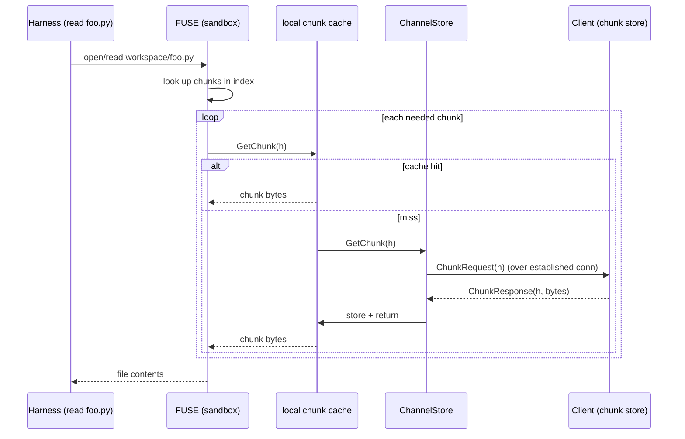
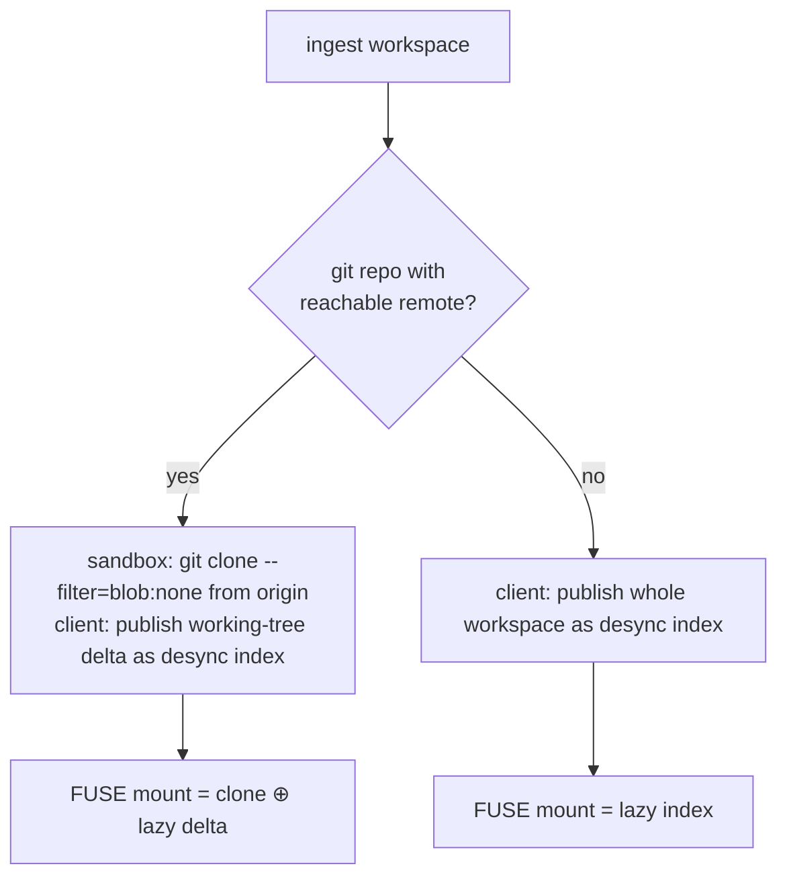

# Mirage — Lazy Workspace Filesystem + Client-Initiated Transport

> **Mirage**: the sandbox sees a full local filesystem that isn't really there — files materialize only when the agent touches them, fetched on demand over a single client-initiated connection.

**Status:** Draft for discussion
**Author:** —
**Last updated:** 2026-06-07
**Background (optional):** [`remote-sandbox-harness.md`](./remote-sandbox-harness.md) explains *why* a remote sandbox and the A/B/C options trade-off. That decision is already made; **this doc is self-contained for implementation** and you do not need to read it to build this.

---

## 1. Scope

The chosen architecture is a **remote cloud sandbox + workspace sync**: a thin client on the user's machine, the agent harness running in a cloud Linux sandbox, and the workspace made available to the sandbox. Two things were left to specify:

- **Large workspaces.** Uploading a whole monorepo per session is a non-starter.
- The concrete **transport** and **file-access mechanism** between the client and the sandbox.

This doc resolves both. It specifies *how the cloud sandbox sees the workspace as a local filesystem without the whole workspace ever being eagerly uploaded*, and *how the client and sandbox talk*. It is **self-contained for implementation** — the agent harness internals are out of scope (see §10).

### Decisions locked in (inputs to this design)

1. **Materialization:** lazy, content-addressed via **desync/casync** — fetch only the chunks the agent actually reads, cache aggressively. When the workspace is a **git repo with a reachable remote**, the sandbox **clones from the git remote** at cloud bandwidth and the client ships only the *working-tree delta*.
2. **Clients:** **Windows and macOS.** A single Go binary. **No sandbox, no FUSE, no Hyper-V/WSL2 on the client.**
3. **Transport:** **gRPC bidi streaming** (default) or **WebSocket** (fallback) — **always initiated by the client.** The cloud sandbox ("server") never dials the client.
4. **Filesystem on the sandbox:** the harness reads the workspace through normal POSIX calls; a **FUSE mount** backs those reads and faults chunks in over the established connection.
5. **Implementation workspace:** this is built in a **separate repo that holds *both* the client and the server (sandbox-side) source** — see §10.

---

## 2. The key idea in one picture

The agent on the sandbox reads files normally. Underneath, a FUSE layer turns a read it can't satisfy from local cache into a **chunk request sent back down the connection the client opened.** The client serves the chunk from its local chunk store. The connection is opened once, outbound, and never the other way.

```
  CLIENT (Win/Mac, thin)                         CLOUD SANDBOX ("server")
  ┌───────────────────────────┐                 ┌──────────────────────────────┐
  │ Go CLI                    │                 │  Agent harness               │
  │  • TUI / permission UI    │                 │   reads workspace/foo.py ────┐│
  │  • workspace indexer      │                 │            (POSIX read)      ││
  │  • chunk store (by hash)  │                 │   ┌──────────────────────┐   ││
  │  • write-back applier     │                 │   │ FUSE mount (lazy)    │◄──┘│
  │                           │                 │   │  • local chunk cache │    │
  │  workspace/  (truth)      │                 │   │  • desync index      │    │
  │  ~/.ssh, creds  NEVER     │                 │   └─────────┬────────────┘    │
  │     indexed, never served │                 │      cache miss → GetChunk(h) │
  └────────────┬──────────────┘                 └─────────────┬────────────────┘
               │                                              │
               │   ┌──────────────────────────────────────┐  │
               └──►│  ONE client-initiated bidi connection │◄─┘
                   │  (gRPC bidi over TLS / WS over TLS)    │
                   │  multiplexed logical channels:         │
                   │   control · agent-events · prompts ·   │
                   │   CHUNK-REQ (server→client request) ·  │
                   │   CHUNK-RES (client→server data) ·     │
                   │   write-back (server→client changes)   │
                   └────────────────────────────────────────┘
   Client dials OUT once. The server *requests* chunks over that same socket.
   Server can only ask for chunk hashes that exist in the index the client published.
```

---

## 3. Why this satisfies "connection always starts from the client"

The constraint is **outbound-only**: the client sits behind NAT/firewall, the sandbox must never connect *in*. But the sandbox is the *reader* — on a cache miss it needs data from the client. These are reconciled by separating **who opens the socket** from **who originates a request on it**:

- The **client opens** one long-lived bidirectional connection (gRPC bidi stream, or a WebSocket). TLS, authenticated, connection-bound token.
- Over that **full-duplex** channel, **either side can send a frame.** The sandbox sends `ChunkRequest` frames *down* the existing pipe; the client answers with `ChunkResponse` frames *up*.

This is the same pattern used by reverse SSH tunnels, LSP/DAP, and self-hosted CI runners: the firewalled side dials out and holds the pipe; the other side drives over it. Both transports support it natively:

| | gRPC bidi | WebSocket |
|---|---|---|
| Full-duplex after client opens | ✔ (HTTP/2 stream) | ✔ |
| Multiplexing | ✔ native (HTTP/2) | one logical mux on top, or multiple WS |
| Typed schema / codegen | ✔ protobuf | ✗ (hand-rolled JSON/msgpack) |
| Flow control / backpressure | ✔ HTTP/2 | manual |
| Hostile-proxy friendliness | good | **best** (looks like HTTPS) |

**Recommendation:** **gRPC bidi** as the default — the chunk protocol benefits from typed frames, multiplexing, and HTTP/2 flow control. Keep **WebSocket** as a fallback for networks that mangle gRPC. The frame schema is transport-agnostic so the two share one protocol definition.

---

## 4. The filesystem layer (desync + git)

### 4.1 What we use from desync/casync

[`folbricht/desync`](https://github.com/folbricht/desync) (Go reimplementation of `casync`) gives us the hard parts off the shelf:

- **Content-defined chunking (CDC):** files are split into variable-size chunks keyed by content hash. Identical content anywhere in the tree (or across sessions) is one chunk.
- **Index format** (`.caibx`/`.caidx`): a small manifest = ordered list of `(chunk hash, size)`. This is what the client sends up front; it is *tiny* relative to the tree.
- **Pluggable `Store` interface:** `GetChunk(id) → chunk`. desync ships HTTP/S3/local stores **and lets us implement our own.** This is the integration seam.
- **Store chaining / local cache:** a fast local cache store in front of a slow remote store; misses fall through, hits stay local.

> **The one custom piece we write:** a `Store` implementation — call it `ChannelStore` — whose `GetChunk(hash)` does not hit S3/HTTP but instead **sends a `ChunkRequest` over the gRPC/WS channel to the client and awaits the `ChunkResponse`.** desync's cache-store chaining then wraps it: `localCache → ChannelStore`. That's the entire bridge between "lazy filesystem" and "outbound-only socket."

### 4.2 The FUSE mount

The harness reads `workspace/...` via POSIX. A FUSE filesystem on the sandbox serves those reads from the index + store chain:

- **`casync mount`** can FUSE-mount a directory index directly, or
- a **thin custom FUSE layer** over desync's index + `Store` (preferred — it lets us mount a directory tree backed by our `ChannelStore` and control caching/prefetch precisely).

Cold read of a file = fault its chunks: check local cache → on miss, `ChunkRequest` round-trip → cache → serve. Warm read = local, near-native speed.



### 4.3 The git fast-path

When the workspace root is a git repo **and** has a reachable remote:

1. The sandbox **clones from the git remote** (GitHub/GitLab/internal) at cloud bandwidth — partial clone (`--filter=blob:none`) so even that is lazy. The committed tree **never traverses the client's slow uplink.**
2. The client computes the **working-tree delta** vs. the cloned commit: dirty tracked files + untracked (minus ignores). Only this delta is published as a desync index and served on demand.
3. The sandbox overlays the delta on top of the clone.

For non-git workspaces (or no reachable remote), skip step 1 — the **whole** workspace is published as a desync index and faulted lazily. Either way the read path in §4.2 is identical; git just changes *where the bulk comes from*.



### 4.4 Write-back (sandbox → client)

The agent edits files in the sandbox. Changes must reach the real workspace. Same channel, reverse direction:

- The FUSE layer (or a sandbox-side watcher) records writes within the workspace root.
- Changed files are re-chunked; the sandbox sends **new chunks + a path/index update** *up* to the client.
- The client applies them to the local workspace, gated by:
  - **Base-hash conflict check** — if the local file changed since publish *and* the sandbox changed it → conflict.
  - **Permission prompt** in the TUI (see §6) — recommend prompt-on-conflict given the sensitivity context.
- Write-backs are confined to the workspace root on the client; path traversal outside is rejected.

---

## 5. Caching, prefetch, snapshots

Lazy fetch trades first-read latency for not-uploading-everything. These reduce the latency tax:

1. **Local chunk cache** on the sandbox (desync cache store). Re-reads are free.
2. **Prefetch heuristics:** on a directory listing or a `read_file`, optimistically push neighboring/likely chunks; on git checkout, prefetch the working set. The client can also *proactively* stream hot chunks.
3. **Warm snapshots:** after first hydration, snapshot the sandbox keyed by `(workspace, commit)`. Next session resumes warm — first-fault cost paid once, not per session. Opt-in only; Modal/Daytona-style hibernation gives this nearly for free.
4. **Cross-session chunk reuse:** content-addressing means an unchanged file is the same chunks across sessions and across users — a shared chunk cache dedupes globally.

### The search fault-storm (must design for)

A repo-wide `ripgrep`/`search_files` reads *every* file → faults *every* chunk → defeats laziness and floods the channel.

**Mitigation (required, not optional):** maintain a **server-side content index** (Zoekt / Sourcegraph-style) built once at ingest and updated on write-back. The agent's `search_files` tool queries the index instead of scanning the materialized tree. Without this, lazy materialization is unusable for any nontrivial repo. This is a real subsystem — budget for it.

---

## 6. Security model

The agent is untrusted relative to the client machine. The baseline controls:

- **Scope to the workspace only.** The client never reads outside the granted workspace root — no home dir, no `~/.ssh`, no credential stores.
- **Secrets *within* the workspace.** A default `.gitignore`-aware ignore policy plus a secrets denylist (`.env*`, `*.pem`, `id_*`, credential files), with a first-publish review surfaced in the TUI ("about to publish these; N look like secrets").
- **Transport security.** TLS everywhere; authenticated, short-lived, connection-bound session tokens.
- **Ephemeral sandboxes.** Fresh per session, destroyed after; no cross-tenant reuse; encrypted at rest; opt-in snapshots only.
- **Egress control on the sandbox.** The sandbox holds workspace data in cache — prevent exfiltration via an egress allowlist; log network access.
- **Local permission prompts.** Risky actions (applying write-backs, destructive commands, network actions) gate behind a local TUI approval. The remote harness can never silently act on the user's files.
- **Audit log.** Every chunk served, file written back, and command run, per session.

This design then **adds/sharpens** the following, specific to the lazy-FS + outbound-only model:

1. **Chunk-hash protocol, not path protocol.** The server requests chunks **by content hash**, and the client **only honors hashes present in the index it published.** The server cannot ask for `/etc/passwd` or `~/.ssh/id_rsa` — those hashes don't exist in the index. The exclude/secret policy at **index-build time** is the security boundary, and it's enforced on the client where the files actually live.
2. **Outbound-only, reaffirmed.** The client opens the socket; the server only ever drives over an existing, authenticated, connection-bound session. No inbound listener on the client.
3. **Scoped index build.** The indexer applies the ignore + secrets denylist *before* chunking. Secret files are never chunked, so their chunks can never be requested.
4. **Write-back confinement.** Applied only within the workspace root, with conflict detection and a local permission prompt.

---

## 7. Is it achievable? Honest assessment

**Yes.** Nothing here requires inventing a primitive. The risk is integration and latency tuning, not feasibility.

| Component | Status | Risk |
|---|---|---|
| Client-initiated bidi, server-drives-over-it | Standard pattern (reverse tunnel / CI runner) | **Low** — supported natively by gRPC bidi and WS. |
| desync content-addressed chunking + index + `Store` | Off the shelf (folbricht/desync, Go) | **Low** — mature library. |
| `ChannelStore` (custom `Store` over the socket) | We write it | **Low–Med** — small, well-bounded; the core new code. |
| FUSE mount of a directory backed by our store | casync mount, or thin custom FUSE | **Med** — directory-tree FUSE + caching/prefetch is real work; desync gives the chunk layer, we supply the FUSE glue. |
| git partial-clone fast path | Native git | **Low**. |
| Write-back + conflict handling | We write it | **Med** — correctness-sensitive; needs base-hash tracking + prompts. |
| Cold-read latency / search fault-storm | Inherent to lazy FS | **Med–High** — *the* performance risk. Mitigated by cache + prefetch + **server-side search index** + warm snapshots. Must be designed in, not bolted on. |
| Windows/Mac client | Go, no FUSE/sandbox on client | **Low** — this design *removes* the Windows isolation problem entirely. |

**The two things that will actually take effort:**
1. The **FUSE + `ChannelStore` + cache/prefetch** assembly on the sandbox — the heart of "reads like a local FS."
2. Making **search not fault the whole tree** — the server-side content index is mandatory, not a nice-to-have.

Everything else is wiring well-understood pieces together.

---

## 8. Open questions

1. **gRPC bidi vs. WebSocket as the *default*** — gRPC for typing/flow-control, WS for proxy-hostile networks. Ship gRPC first, WS fallback?
2. **Chunk size / CDC parameters** — tune for many-small-files (source trees) vs. few-large-files; affects fault count and dedup ratio.
3. **Prefetch policy** — how aggressive before it wastes bandwidth? Access-driven vs. static (whole-dir-on-first-touch)?
4. **Search index choice** — Zoekt vs. Sourcegraph vs. a lighter homegrown trigram index; who builds/updates it, and when.
5. **Write-back granularity** — per-save streaming vs. batched-on-idle; conflict UX.
6. **Snapshot key & eviction** — `(workspace, commit)`? How long to retain warm sandboxes; multi-tenant chunk-cache isolation.
7. **Disconnect/resume** — connection drops mid-fault: retry semantics, resumable streams, session survival.
8. **Binary / huge single files** — do we lazily fault a 2 GB asset chunk-by-chunk, or refuse/stream it specially?

---

## 9. Phased plan

- **Phase 0 — Transport spike:** Go client dials out (gRPC bidi); server sends a request frame back over the same connection; client answers. Prove "outbound-only, server-drives."
- **Phase 1 — desync round-trip:** client indexes a dir + serves chunks by hash; sandbox `ChannelStore` fetches a known chunk over the channel. No FUSE yet.
- **Phase 2 — Lazy FUSE read:** mount the index on the sandbox; harness reads a file; chunks fault over the channel; local cache works.
- **Phase 3 — git fast-path:** detect remote, partial-clone on sandbox, publish + overlay working-tree delta.
- **Phase 4 — Write-back:** sandbox edits stream back; base-hash conflict detection; TUI prompt.
- **Phase 5 — Search index:** server-side content index; `search_files` queries it instead of scanning FUSE.
- **Phase 6 — Prefetch + snapshots:** prefetch heuristics, warm-snapshot resume, shared chunk cache.
- **Phase 7 — Hardening:** secret-exclusion at index build, egress allowlist, disconnect/resume, multi-tenant isolation review.

---

## 10. Implementation workspace (client + server in one repo)

This design is implemented in a **separate, dedicated workspace** so we can iterate and validate the transport + lazy-FS round-trip quickly, independent of the Hermes agent repo. **That workspace contains both the client and the server (sandbox-side) source code** — they share one protocol definition and evolve together, so a monorepo is the right call.

```
mirage/                          (new repo — both sides live here)
├── proto/                       shared protocol (single source of truth)
│   └── mirage.proto             bidi stream, chunk frames, write-back, prompts
├── client/                      Go — runs on Windows + macOS, thin
│   ├── transport/               dials OUT (gRPC bidi / WS), holds the connection
│   ├── index/                   workspace indexer (desync CDC + secret excludes)
│   ├── chunkstore/              serves chunks by hash (answers ChunkRequest)
│   ├── writeback/               applies sandbox edits, conflict detection
│   └── tui/                     Bubble Tea UI + permission prompts
├── server/                      Go — runs on the cloud Linux sandbox
│   ├── transport/               accepts the client-initiated connection
│   ├── channelstore/            desync Store whose GetChunk() = ChunkRequest over the channel
│   ├── fuse/                    FUSE mount backed by index + channelstore + local cache
│   ├── git/                     partial-clone fast path
│   └── search/                  server-side content index (Zoekt/Sourcegraph adapter)
├── docs/                        the two design docs travel with the repo
└── HANDOFF.md                   orientation for whoever picks this up
```

- **Client and server are both Go.** desync and `go-fuse` are Go; one language across both sides keeps the shared protocol and chunk logic DRY.
- **The connection is always client→server** (§3). `client/transport` dials; `server/transport` only ever *accepts* and then drives over the open stream.
- **Boundary with the Hermes harness:** the Python harness consumes the FUSE mount as a normal directory — integration is a new `BaseEnvironment` backend in the Hermes repo, and is **out of scope for this workspace**. Early phases use a stub "harness" (a process that reads/writes the mount) to validate the FS round-trip.

---

## Appendix: building blocks

| Concern | Library / approach |
|---|---|
| Content-addressed chunking, index, Store | `folbricht/desync` (Go) — custom `Store` for the channel bridge |
| Directory FUSE mount | `casync mount`, or custom FUSE (`hanwen/go-fuse`) over desync index + Store |
| Transport (default) | `google.golang.org/grpc` bidi streaming over TLS |
| Transport (fallback) | `coder/websocket` over TLS |
| git lazy clone | native git `clone --filter=blob:none` + sparse-checkout / `scalar` |
| Client file watching | `fsnotify/fsnotify` |
| Server-side code search | Zoekt / Sourcegraph, or homegrown trigram index |
| Sandbox snapshot/resume | Modal / Daytona-style hibernation |
</content>
</invoke>
