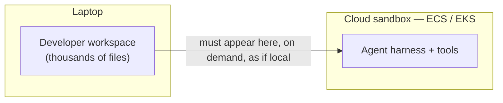
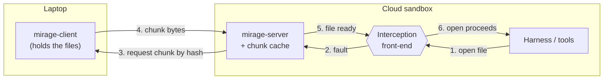
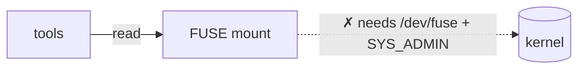
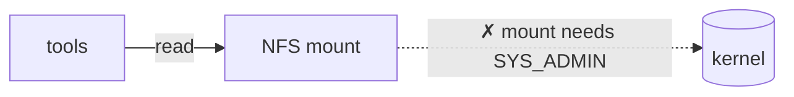
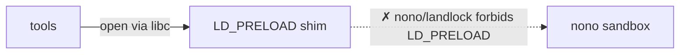
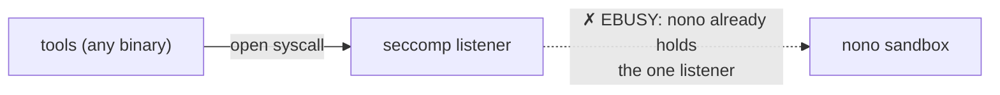
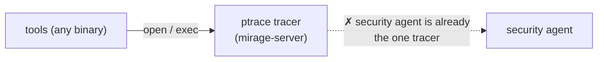
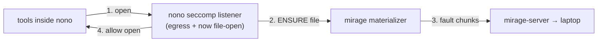

# Streaming a laptop workspace into a cloud agent sandbox — options, blockers, and path forward

**Last updated:** 2026-06-21

---

## TL;DR

We want a developer's laptop files to appear inside a cloud agent sandbox **on
demand** — lazily, transparently, and securely — instead of copying the whole
workspace up front (today's slow path). The hard part is *not* moving the bytes:
that data plane is built and proven. The hard part is **interception** — noticing
"a tool just opened a file" so we can fetch it just in time.

Every transparent OS-level interception mechanism we tried is either **denied by
platform policy** (no elevated Linux capabilities) or **already occupied by the
security stack itself**: the agent sandbox (**nono**) owns the one seccomp
notification listener and forbids `LD_PRELOAD`; the company security agent owns
the single ptrace slot; FUSE/NFS need `SYS_ADMIN`, which is not granted. The code
that must be intercepted runs **inside nono**, so no external mechanism can reach
it.

The technology works — we validated the full lazy-streaming path on EC2 via
ptrace. The blocker is purely a collision with platform security tooling.
**Path forward: engage the team behind nono to intercept cooperatively** (nono
already traps syscalls; have it also signal file-opens to our materializer). EC2
with an ASG is a documented fallback, but its startup lag, scaling cost, and
unconfirmed security sign-off make it a stopgap, not the answer.

---

## 1. Problem statement

Our agents run in a cloud sandbox and operate on the developer's workspace — the
files on their laptop. For the sandbox to be useful, those files must be readable
**as if they were local**: unmodified tools (`python`, `node`, `git`, compilers,
search) just open paths and read them.

**Today (the slow path): eager copy.** Before the harness can start, we transfer
the *entire* workspace into the sandbox. This is what exists today, predating
this effort. It makes startup slow — the agent waits for a full upload before it
can do anything — and that latency is exactly the problem we set out to remove.

**What we actually need:**

| Requirement | Why |
|---|---|
| **Lazy** | Fetch only the files the agent touches, only when it touches them — no full up-front transfer. |
| **Transparent** | Unmodified tools must work; we can't rewrite every tool to call an API. |
| **Covers all binaries** | Agent toolchains include Go/Rust/static binaries, not just libc tools. |
| **No elevated capabilities** | The platform forbids `SYS_ADMIN`, `SYS_PTRACE`, privileged containers. |
| **Secure** | The cloud side must not be able to read arbitrary laptop files or run commands on the laptop (see §3). |
| **Scales on ECS/EKS** | These are our standard, auto-scaling runtimes; EC2 self-management is costly (see §9). |

---

## 2. Mirage in brief — the common substrate

All options below are built on **Mirage**, the system we're building for this.
Mirage has two parts: a thin **client** on the laptop and a **server** in the
sandbox. Files are split into content-addressed **chunks**; the server fetches
them lazily over **one connection the client dials out** (the server never dials
in). The same data plane underlies every option.

> Steps 3 and 4 above — the two laptop↔cloud hops (the chunk request and its
> response) — run **down the stream the client already dialed**: the server
> originates requests on that open connection; it never opens a connection to the
> laptop.

**The key framing for this whole document:** the data plane (chunks, transfer,
caching, the on-demand *materializer*) is **constant and proven**. The **only**
thing that changes between options is the **interception front-end** — box `X`
above: *how* the sandbox notices a file was opened so Mirage can fault it. Every
option is the same Mirage with a different box `X`. So when an option fails, it's
box `X` that failed, never the transfer itself.

---

## 3. Security properties (why this is safe to point at a laptop)

Because the cloud server reads from a developer's machine, the trust boundary
matters. Mirage is designed so a **compromised or buggy cloud sandbox cannot roam
the laptop or run code on it**:

- **Hash-addressed, not path-addressed.** The server can only request chunks **by
  hash**, and only hashes the client already published. The client **rejects** any
  hash it didn't publish. The server cannot ask for "`/home/user/.ssh/id_rsa`" —
  it has no way to name an arbitrary path.
- **Secrets never leave the laptop.** Secret/excluded files are filtered out at
  index time and never chunked, so their chunks **cannot exist** in the protocol
  and **cannot be requested**.
- **Client dials out; server never dials in.** There is no inbound port on the
  laptop. The connection is always laptop → cloud.
- **No command channel.** The protocol moves chunk bytes and nothing else. There
  is no mechanism for the cloud side to execute commands on the laptop.

Net: the blast radius of a compromised sandbox is bounded to the **non-secret
files the developer chose to publish** — not the filesystem, and not code
execution.

---

## 4. The constraints that decide everything

Every option is judged against the platform reality at the company. Two facts
dominate:

1. **No elevated Linux capabilities.** Containers run unprivileged: no
   `SYS_ADMIN` (so no `mount`), no `SYS_PTRACE` granted by policy, no privileged
   sidecars.
2. **The security stack already owns the interception primitives.** The agent
   sandbox **nono** (an open-source, landlock-based sandbox for running
   agent-generated code) and the company **security agent** each consume exactly
   the kernel hooks Mirage would need:
   - nono uses a **seccomp user-notification listener** for hostname-based egress
     filtering — and the kernel allows only **one** notification listener per
     process tree.
   - nono's **landlock** policy **forbids `LD_PRELOAD`**.
   - the security agent **ptraces** processes to scan them — and a process can
     have only **one** tracer.

And critically: **the code we must intercept runs *inside* nono.** So the
interception has to happen within nono's jurisdiction — an external mechanism
can't see those file opens even if it were allowed to run.

> **This is the whole difficulty in one sentence:** Mirage needs precisely the
> syscall-interception hooks that the company's security and sandboxing tools are
> built to monopolize — and the target lives inside the tool that holds them.

---

## 5. Options we tried

Each option is the same Mirage data plane with a different interception box `X`.
Same skeleton, different mechanism, different blocker.

### 5.1 FUSE mount

A userspace filesystem presents the workspace as a normal directory; the kernel
routes reads to Mirage, which faults the needed **chunks** (byte ranges).

- **Granularity:** chunk / byte-range — the finest; reads only the bytes touched.
- **Covers Go/static binaries:** yes (kernel-level).
- **Blocker:** mounting FUSE needs `/dev/fuse` and `SYS_ADMIN`, which the platform
  does not grant. **Ruled out.**

### 5.2 NFS mount

Back the workspace with an NFS server; the sandbox mounts it and reads ranges
over the protocol.

- **Granularity:** chunk / range (NFS does range reads).
- **Covers Go/static binaries:** yes (kernel-level).
- **Blocker:** `mount` in a container needs `SYS_ADMIN`. Same denial as FUSE.
  **Ruled out.**

### 5.3 LD_PRELOAD shim

Inject a small library that interposes the libc `open` family; on each open under
the workspace it asks Mirage to materialize the file first.

- **Granularity:** whole-file (the open is the choke point).
- **Covers Go/static binaries:** **no** — Go/static binaries issue raw syscalls
  and bypass libc entirely.
- **Blocker:** the target runs inside **nono**, whose landlock policy **does not
  permit `LD_PRELOAD`**. **Ruled out.** (Also wouldn't cover Go/static even if
  allowed.)

### 5.4 seccomp user-notification

Install a seccomp filter that traps the `open` family to a notification listener;
Mirage services each trap by materializing the file, then lets the syscall
continue. Covers Go/static because it works at the syscall layer.

- **Granularity:** whole-file.
- **Covers Go/static binaries:** yes.
- **Blocker:** the kernel allows **one** seccomp notification listener per process
  tree, and **nono already holds it** for egress filtering. Mirage's listener
  gets `EBUSY`. **Ruled out.** (This is the original reason we moved to ptrace.)

### 5.5 ptrace (side-attach)

Mirage runs as a side process, attaches to the workload with `PTRACE_SEIZE`, and
services a lightweight syscall trap on the `open`/`exec` family — same whole-file
materialization, no listener needed.

- **Granularity:** whole-file.
- **Covers Go/static binaries:** yes — **and** covers executing workspace files.
- **What we validated:** the **full lazy-streaming path works end to end on an
  EC2 instance behind an ASG.** This is our proof the mechanism and data plane are
  correct.
- **Blocker on ECS:** the security agent already **ptraces** processes to scan
  them, and a process can have only one tracer — Mirage can't attach.
- **Blocker on EKS:** the OPA policy **denies `SYS_PTRACE`** outright.
- **Status:** works on EC2; **blocked on both ECS and EKS.**

---

## 6. Comparison

| Option | Interception | Granularity | Go/static | Needs | EC2/ASG | ECS | EKS | Blocker |
|---|---|---|---|---|:---:|:---:|:---:|---|
| Eager copy *(today)* | none (copy up front) | whole **workspace** | ✅ | nothing | ✅ | ✅ | ✅ | not lazy → slow startup (the problem) |
| FUSE mount | kernel FS | **chunk / range** | ✅ | `/dev/fuse` + `SYS_ADMIN` | ⚠️ priv | ❌ | ❌ | needs `SYS_ADMIN` |
| NFS mount | kernel FS | **chunk / range** | ✅ | `SYS_ADMIN` (mount) | ⚠️ priv | ❌ | ❌ | needs `SYS_ADMIN` |
| LD_PRELOAD | libc interposition | whole **file** | ❌ | `LD_PRELOAD` allowed | ✅ | ❌ | ❌ | nono/landlock forbids `LD_PRELOAD` |
| seccomp-notify | syscall trap (listener) | whole **file** | ✅ | the one seccomp listener | ✅ | ❌ | ❌ | nono owns the listener (`EBUSY`) |
| **ptrace** | syscall trap (tracer) | whole **file** | ✅ | `SYS_PTRACE` + sole tracer | ✅ **validated** | ❌ | ❌ | security agent is the tracer / OPA denies cap |

Note the irony: the **finest-grained** options (FUSE/NFS, byte-range) are the most
privileged and most blocked; the options that survive only fault **whole files**.

---

## 7. Why this is fundamentally hard

Transparent + lazy file access **requires** intercepting file syscalls. Every
mechanism to intercept file syscalls **requires** either a privilege the platform
denies (`SYS_ADMIN`, `SYS_PTRACE`) or a hook the security stack already owns (the
seccomp listener, the ptrace slot) or forbids (`LD_PRELOAD`). And the workload we
must intercept runs **inside nono**, the very tool holding those hooks.

So this isn't a series of unlucky, independent failures — it's **one structural
collision**: Mirage and the security stack are contending for the same scarce
kernel primitives, on the same processes. Any *external, transparent* mechanism
will hit the same wall. That points the way out: stop competing with nono, and
**intercept through it**.

---

## 8. Considered and ruled out by analysis

For completeness — these don't clear the same constraints and were not pursued:

- **virtiofs / 9p** — need a `mount` (`SYS_ADMIN`) or a VM/virtio transport we
  don't control on ECS/EKS containers.
- **Privileged sidecar** — "privileged" is the exact thing denied.
- **gVisor hooks** — only available if the platform runs the gVisor runtime, which
  ours does not; adopting it is a platform-wide change, not a Mirage change.
- **Unprivileged FUSE via user namespaces** — still needs `/dev/fuse` and
  unprivileged user namespaces, blocked by the same posture, and would have to be
  set up inside nono.

They all collapse to the same root cause as §7.

---

## 9. Recommendation & next steps

**Primary: cooperative integration with nono.** nono already runs a seccomp
user-notification listener and traps syscalls. The proposed integration: have
that **same listener also trap the `open`/`exec` family and call Mirage's
materializer** (the file-fault socket we already built) before allowing the
syscall. Mirage's data plane, materializer, and chunk store are **unchanged** —
nono simply becomes interception box `X`. Because nono is **open source**, this
is a contribute-or-fork effort, not a vendor dependency.

> **Next step:** we are engaging the team behind nono to explore this integration.

**Fallback: EC2 with an ASG.** It works today (via ptrace), but:

- Our RHEL 9 AMI ships **without Docker**; we install it via a userdata script,
  pull the image, and run the harness as a container — a **significant startup
  lag** and harder to scale than ECS/EKS.
- Security sign-off for granting `SYS_PTRACE` (or running outside the standard
  ECS/EKS guardrails) is **not yet confirmed**.

So EC2 is a stopgap, kept on the table only if the nono integration proves
infeasible.

**Not an option: eager copy.** It's the slow status quo this effort exists to
replace (§1).
